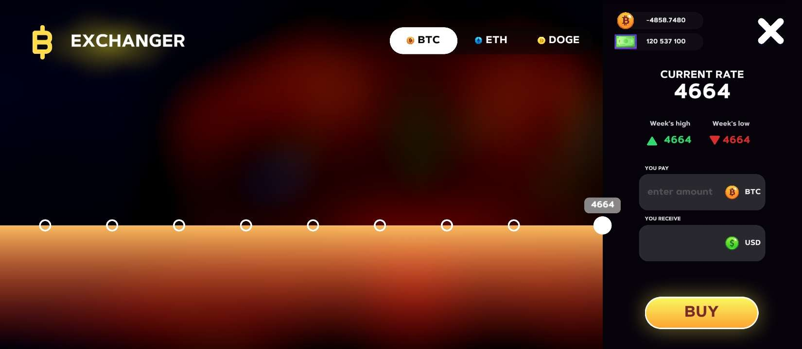

# currency-exchange
Currency rate server reimplementation for PC Creator 2 

# Public Instances
There are currently no publicly available instances to use. If you run an instance and want to be featured here, open a pull request or an issue.

# Configuring
You can configure some of the things to your liking!

You will have to edit the code slightly, but it's nothing too hard!

You can find the configuration values at the top of the file, right after the imports
## currencies (`map[string]Currency`)
A map of currencies, where the currency name (`BTC` for example) is the key, and a Currency structure is the value (contains minimal and maximal values for price)

## absInterval (`untyped int`)
> Default: `6`

Interval for updating the current prices (in seconds by default)

## timelineLimit (`int`)
> Default: `10`

How many past prices the server should log in memory.

## interval (`time.Duration`)
> Default: `absInterval * time.Second`

The actual interval. You should only change this if you want the interval to be in a different scale (minutes for example)

# Compatibility
The server does not behave 1 to 1 with the game one. However, the required behaviour is essentially 1 to 1, so this works with the game.

# Building
You must have the [Go programming language](https://go.dev) installed
1. Clone the repository
2. Run the `build.sh` script
3. If prompted, install any needed dependencies and run the script again

It will output a binary named `main` that is the server
